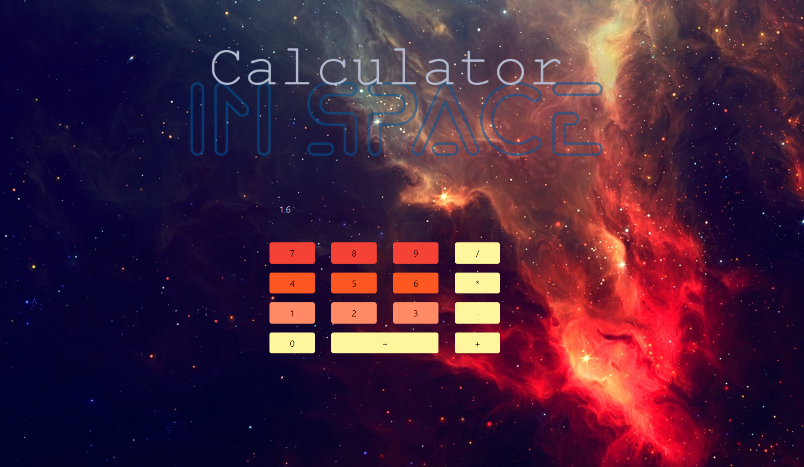

# Calculator... 
## In Space

This fun project was to teach us how modules work. How do multiple pages of JavaScript work? Why do we need them? What do we call them? What do we put in each one? This was the introduction to such questions, using math and switch methods as well. In the end, we made a pretty cool calculator which I took the liberty of fancying with a space theme. You can blame my binge obsession with SG-1. 

## Screenshots 


## How to run this project
* Use npm to install http-server in your terminal:
```sh
npm install -g http-server
```
* Run the server:
```sh
hs -p 9999
```
* Open Chrome and navigate to 
```
localhost:9999
```

